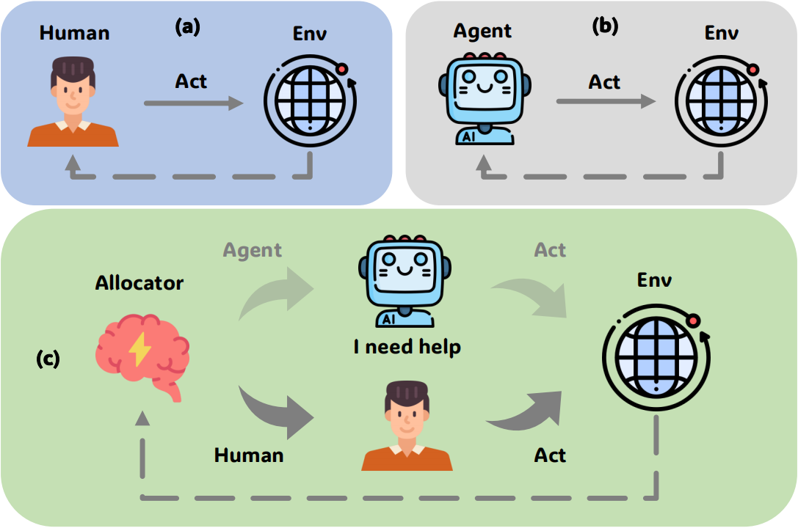
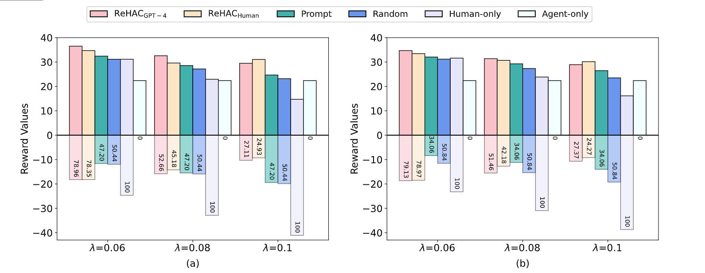

# Large Language Model-based Human-Agent Collaboration for Complex Task Solving
This repository is based on our paper: "Large Language Model-based Human-Agent Collaboration for Complex Task Solving". It contains the human-computer collaboration dataset we generated, as well as demo code for our fine-tuned human-agent collaboration policy model.   
<div  align="center">    

</div>

## Overview
- The Code for different datasets is in `hotpotqa/`, `strategyqa/`, and `intercode/`.
  - start training by `scripts/run.sh`
  - local test environment is in `test_data/`
- Human-Agent Collaboration Dataset in `dataset/`

## Usage
### Getting Start
You can use following scripts to install related python package through pip:
```
git clone https://github.com/XueyangFeng/ReHAC.git
cd ReHAC
pip install -r requirements.txt
```

### Constructing Training Data
```
python data_preprocess.py ./dataset/gpt4/hotpotqa.jsonl 0.08 ./hotpotqa/data/advantage_sample_count_0.08.jsonl
```

### Training and Test Process
```
cd hotpotqa/scripts
sh run.sh
```

## Results
We random sample 100 questions for test for each dataset.
Evaluation result of HotpotQA dataset is under the following figure:
<div  align="center">    

</div>

(a) Human-agent collaboration evaluation. (b) GPT-4-agent collaboration evaluation. The bars below the 0-axis represent the human intervention cost $$\lambda C$$, the entire columns, composed of the bars above and below the 0-axis, represent the task reward $$T$$, and the bars above the 0-axis represent the reward $$R$$ ($$R=T - \lambda C$$). Numbers within the bars means the human intervention rate %. $$\text{ReHAC}_{\text{GPT-4}}$$ and $$\text{ReHAC}_{\text{Human}}$$ represent the policy model trained on GPT-4-agent and human-agent collaboration datasets, respectively. ReHAC outperforms other baselines in human-agent collaboration scenarios.

We provide original evaluation outputs of ReHAC under hotpotqa/results, strategyqa/results, and intercode/results.

     
  
<br/>

We provide original evaluation outputs of ReHAC
under `hotpotqa/results`, `strategyqa/results`, and `intercode/results`.

## Citation
If you are interested in our work, please cite the following paper as the reference. TODO
